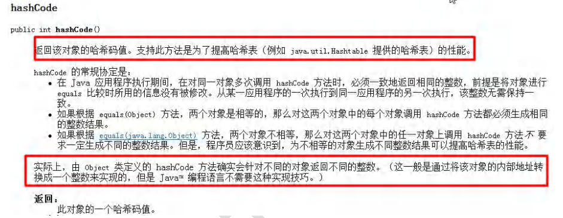

# Object类详解

## 1、equals 与 ==

### ==是一个比较运算符

1. == ：既可以判断基本类型，又可以判断引用类型。
2. == ：如果判断基本类型，判断的是值是否相等。
3. == ：如果判断的是引用类型，判断的是地址是否相等，即判定的是不是同一个对象。

实例代码如下：

```java
public class equals01 {
    public static void main(String[] args) {
        B b = new B();
        B c=b;
        B d=c;
        System.out.println(b==c);//true
        System.out.println(d==b);//true
        A a=b;//向上转型，运行类型为B，编译类型为A
        System.out.println(a==b);//true
        //a，b，c指向的都是B类的同一个对象所以都输出true
    }
}
class A{}//父类
class B extends A{}//子类
```

### equals是Object类的一个方法

1. equals：是Object类中的方法，只能判断引用类型。（看jdk源码）
2. 默认判断的是地址是否相等，子类中往往重写该方法，用于判断内容是否相等。比如Integer，String。

#### Object中equals方法的源代码

```java
    public boolean equals(Object obj) {//就是判断两个对象是不是同一个对象
        return (this == obj);
    }
```

#### String中的equals方法的源代码

```java
public boolean equals(Object anObject) {
        if (this == anObject) {//如果是同一个对象
            return true;
        }
        if (anObject instanceof String) {//判断类型
            String anotherString = (String)anObject;//向下转型
            int n = value.length;
            if (n == anotherString.value.length) {//如果长度相等
                char v1[] = value;
                char v2[] = anotherString.value;
                int i = 0;
                while (n-- != 0) {//然后一个一个比较字符
                    if (v1[i] != v2[i])
                        return false;
                    i++;
                }
                return true;//都相等返回true
            }
        }
        return false;//如果比较的不是字符串，则直接返回false
    }
```

#### Integer中的equals方法的源代码

```java
    public boolean equals(Object obj) {
        if (obj instanceof Integer) {
            return value == ((Integer)obj).intValue();
        }
        return false;
    }
```

## 2、如何重写equals方法

### 根据应用实例来了解

判断两个 Person 对象的内容是否相等，如果两个 Person 对象的各个属性值都一样，则返回 true，反之 false。

```java
public class Person {
    private String name;
    private int age;
    private char gender;
    public Person(String name, int age, char gender) {
        this.name = name;
        this.age = age;
        this.gender = gender;
    }
    public String getName() {
        return name;
    }
    public void setName(String name) {
        this.name = name;
    }
    public int getAge() {
        return age;
    }
    public void setAge(int age) {
        this.age = age;
    }
    public char getGender() {
        return gender;
    }
    public void setGender(char gender) {
        this.gender = gender;
    }
    //equals方法的重写
    public boolean equals(Object obj) {
        //判断两个对象是否是同一个对象，是就返回true
        if (obj==this){
            return true;
        }
        
        if (obj instanceof Person){//obj的运行类型是否是Person类或Person类的子类
            Person person=(Person) obj;//向下转型，因为需要访问obj的各个属性
            return this.name.equals(person.name)&&this.age==person.age&&this.gender==person.gender;
        }
        return false;//如果obj的运行类型不是Person类或Person类的子类返回false
   }
}
```

### 不区分大小写，转为大写，转为小写

+ s1.equalsIgnoreCase(s)-->不区分大小写的比较
+ s1.toLowerCase()-->把s1全部转为小写
+ s1.toUpperCase()-->把s1全部转为大写

### 课堂练习

### 1、

```java
public class test {
    public static void main(String[] args) {
        Person person1 = new Person();
        person1.name="jack";
        Person person2 = new Person();
        person2.name="jack";
        System.out.println(person1==person2);//F
        System.out.println(person1.name.equals(person2.name));//String类的equals比较，T
        System.out.println(person1.equals(person2));//Object类的equals比较，F
        String s1 = new String("abc");
        String s2 = new String("abc");
        System.out.println(s1.equals(s2));//String类的equals比较,T
        System.out.println(s1==s2);//  地址/对象的比较，F
    }
}
class Person{
    public String name;
}
```

## 3、hashCode方法



1. 提高具有哈希结构的容器的效率！
2. 两个引用如果指向的是同一个对象，则哈希值肯定是一样的！
3. 两个引用如果指向的是不同对象，则哈希值是不一样的！
4. 哈希值主要根据地址号来的！不能完全将哈希值等价于地址！

### 案例演示：

```java
public class HashCode {
    public static void main(String[] args) {
        AA aa1 = new AA();
        AA aa2 = new AA();
        AA aa3=aa1;
        System.out.println("aa1.hashCode()="+aa1.hashCode());
        //aa1.hashCode()=1163157884
        System.out.println("aa2.hashCode()="+aa2.hashCode());
        //aa2.hashCode()=1956725890
        System.out.println("aa3.hashCode()="+aa3.hashCode());
        //aa3.hashCode()=1163157884
    }
}
class AA{}
```

***注意：后面在集合中hashcode如果需要的话也会重写***

## 4、toString方法

### （1）基本介绍

默认返回：全类名+@+哈希值的十六进制【查看Object的toString方法】

子类往往重写toString方法，用于返回对象的属性信息。

```java
        Monster monster = new Monster("小妖怪", "巡山", 1000);
        System.out.println(monster.toString());
        //Object_.ToString_.Monster@4554617c-->包名.类名@哈希十六进制值
```


### （2）重写toString方法

打印对象或拼接对象时，都会自动调用该对象的toString形式

重写toString快捷键：alt+insert选择toString

```java
    @Override
    public String toString() {	//打印属性的值
        return "Monster{" +
                "name='" + name + '\'' +
                ", job='" + job + '\'' +
                ", salary=" + salary +
                '}';
    }
```

### （3）当直接输出一个对象时，toString方法会被默认的调用

```java
System.out.println(monster);//调用Monster类的toString方法
```

## 5、finalize方法

1. 对象被回收时，系统自动调用该对象的finalize方法。子类可以重写该方法，做一些释放资源的操作等
2. 什么时候被回收：当某个对象没有任何引用时，则jvm就认为这个对象是一个垃圾对象，就会使用垃圾回收机制来销毁该对象，在销毁该对象前，会先调用finalize方法。
3. 垃圾回收机制的调用，是由系统来决定的（即有自己的GC算法），也可以通过System.gc()主动触发垃圾回收机制

```java
public class finalize {
    public static void main(String[] args) {
        Car bmw = new Car("宝马");
        bmw=null;
        System.gc();
        System.out.println("程序结束");
        /*
        运行结果如下：
        程序结束
        我们销毁了汽车宝马
		释放了某些资源
        */
    }
}
class Car{
    String name;

    public Car(String name) {
        this.name = name;
    }

    @Override
    protected void finalize() throws Throwable {
        System.out.println("我们销毁了汽车"+name);
        System.out.println("释放了某些资源");
    }
}
```

