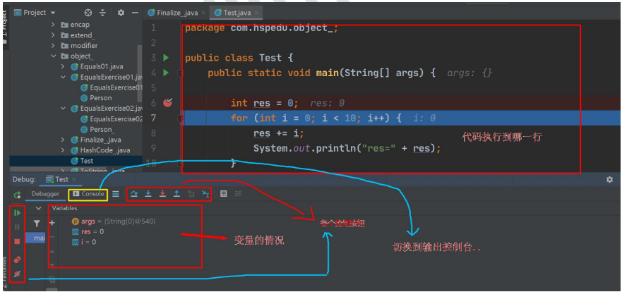
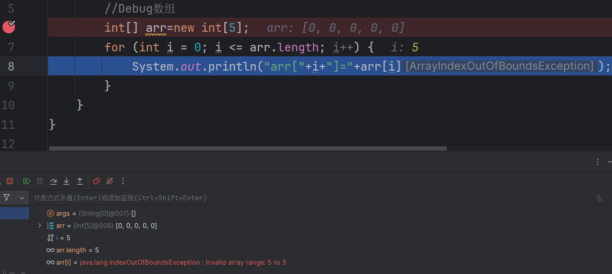
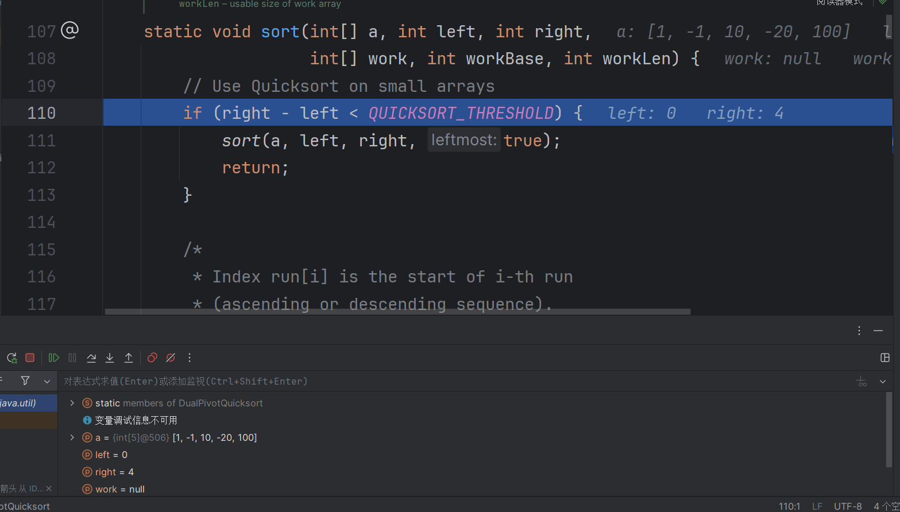
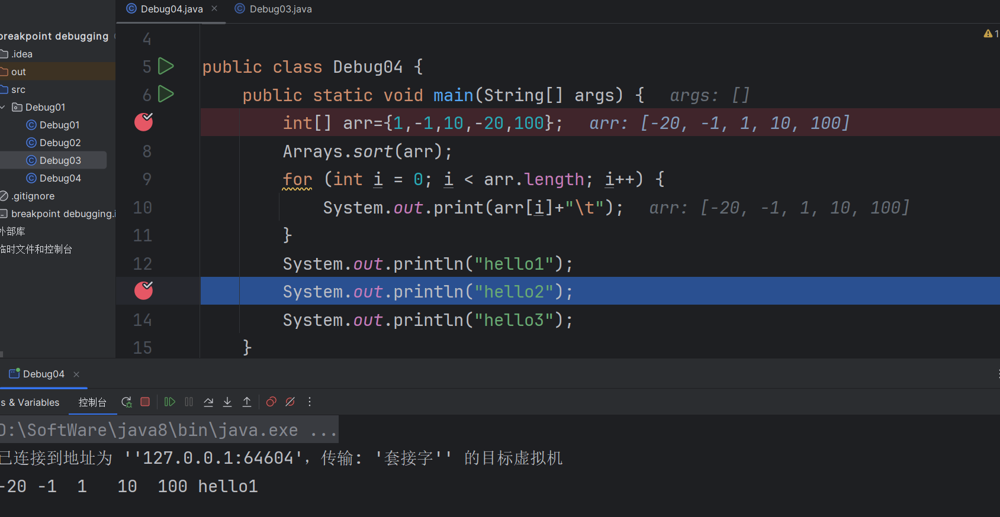

# 断点调试（debug）

## 1、断点调试介绍

1. 断点调试是指程序在某一行设置一个断点，调试时，程序运行到这一行就会停住，然后就可以一步一步往下调试，调试过程中可以看到各个变量当前的值，出错的话，调试到出错的代码行即显示错误，停下。进行分析从而找到
2. 断点调试也能帮助我们查看Java底层源代码的执行过程，提升程序员的Java水平。

## 2、断点调试的快捷键

F7(跳入) 	F8(跳过)	shift+F8(跳出) 	F9(resume,执行到下一个断点) F7：跳入方法内 	F8: 逐行执行代码. 		shift+F8: 跳出方法



## 3、断点调试案例

### 案例一：逐行执行代码

```java
public class Debug01 {
    public static void main(String[] args) {
        //演示逐行执行代码
        int sum=0;		//在此处设置断点按F8一步一步走
        for (int i = 0; i < 5; i++) {
            sum+=i;
            System.out.println("i="+i);
            System.out.println("sum="+sum);
        }
        System.out.println("退出for循环~~~~");
    }
}
```


### 案例二：数组越界异常

```java
public class Debug02 {
    public static void main(String[] args) {
        //Debug数组---用断点调试可以查出数组越界的异常
        int[] arr=new int[5];
        for (int i = 0; i <= arr.length; i++) {
            System.out.println("arr["+i+"]="+arr[i]);
        }
    }
}
```



### 案例三：追溯源代码

***小技巧：将光标放在某个变量上，可以看到最新的数据。***

```java
public class Debug03 {
    public static void main(String[] args) {
        int[] arr={1,-1,10,-20,100};
        Arrays.sort(arr);	//在此处设置断点，按F7进入源代码（或者alt+shift+F7）
        for (int i = 0; i < arr.length; i++) {
            System.out.print(arr[i]+"\t");
        }
    }
}
```



### 案例四：F9直接执行下一个断点（resume）

***断点可以在Debug过程中动态的下断点***

```java
public class Debug04 {
    public static void main(String[] args) {
        int[] arr={1,-1,10,-20,100};		//这里设置第一个断点
        Arrays.sort(arr);
        for (int i = 0; i < arr.length; i++) {
            System.out.print(arr[i]+"\t");
        }
        System.out.println("hello1");
        System.out.println("hello2");		//这里设置第二个断点
        System.out.println("hello3");
    }
}
```


