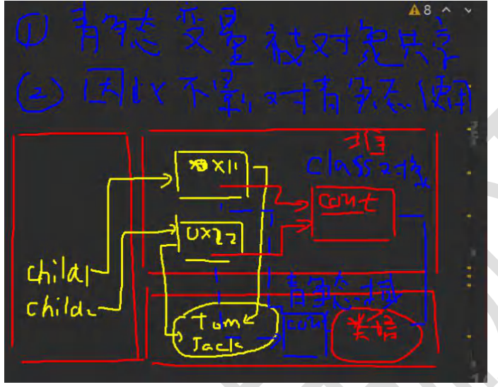

# 类变量

## 1、定义

类变量就是静态变量，是该类的所有对象的共享的变量，任何一个该类的对象去访问它时，取到的都是相同的值，同样任何一个该类的对象去修改它时，修改的也是同一个变量。

### 代码规范

***访问修饰符  static  数据类型  变量名;***（推荐）

​			static  访问修饰符  数据类型  变量名;

### 如何访问类变量

类名.类变量名或者对象名.类变量名[静态变量的访问修饰符的访问权限和普通属性是一样的]

推荐使用：类名.类变量名;

### 具体代码如下:

```java
public class Child {
    String name;
    public static int count;		//类变量，该变量最大的特点就是会被 Child 类的所有的对象实例共享
    public Child(String name) {
        this.name = name;
    }
    public void join(){
        System.out.println(name+"加入了游戏");
    }
}

public class test {
    public static void main(String[] args) {
        Child child1 = new Child("jack");
        child1.join();
        child1.count++;
        Child child2 = new Child("tom");
        child2.join();
        child2.count++;
        System.out.println("共有"+Child.count+"位小朋友加入了游戏");
    }
}
```

## 2、类变量的内存布局



注意：因为JDK版本的问题，有的static变量存放在GC区，有的存放在静态域中，但是记住一点不管static变量存放在了哪里，都有以下两点：

+ ***static变量是同一个类所有对象的共享。***
+ ***static类变量，在类加载的时候就生成了。***

## 3、类变量使用注意事项和细节讨论

### 1、什么时候需要用类变量

当我们需要让某个类的所有对象都共享一个变量时，就可以考虑使用类变量（静态变量）。比如定义一个学生类，统计所有学生共交多少钱，就可以定义一个类变量fee（public static double fee=0;）

### 2、类变量与普通变量的区别

***类变量时该类的所有对象共享的，而实例变量是每个对象独享的。***

### 3、加上static称为类变量或静态变量，否则称为实例变量/普通变量/非静态变量

### 4、实例变量不可以通过 类名.类变量名 方式访问

### 5、类变量在加载的时候就初始化了，也就是说即使没有创建对象，只要类加载了就可以访问类变量了。

### 6、类变量的生命周期是随类的加载开始的，随着类的消亡而销毁。

## 4、类方法

类方法也叫静态方法。

形式如下：

访问修饰符  static  数据返回类型  方法名（）{...}   或者  static  访问修饰符  返回类型  方法名（）{...}

### 1、类方法的调用

+ 类名.类方法名   或者   对象名.类方法名【***前提是满足访问修饰符的访问权限和范围***】

### 2、类方法的经典使用场景

+ 当类方法中不涉及到任何和对象相关的成员，则可以将方法设计成静态方法，提高开发效率。
+ 在程序员的实际开发，往往会将一些通用的方法，设计成静态方法，这样就可以不用创建对象就可以使用了。

### 3、类方法使用注意事项和细节讨论

+ 类方法和普通方法都是随着类的加载而加载，将结构信息存储在方法区：***类方法中无this参数，而普通方法中隐含着this参数。***
+ 类方法可以通过类名调用，也可以通过对象名调用。
+ 普通方法和对象有关，需要通过对象名调用。
+ ***类方法中不可以出现和对象有关的关键字（如this，super）。***
+ 类方法只能访问静态变量或静态方法。
+ 普通成员方法既可以访问非静态成员也可以访问静态成员。

总结：静态方法只能访问静态的成员，非静态的方法可以访问静态成员和非静态成员（***比须遵守访问权限***）。