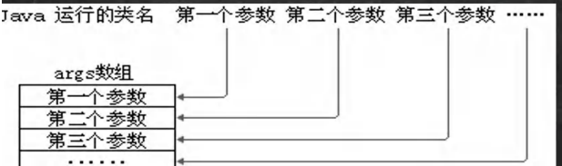
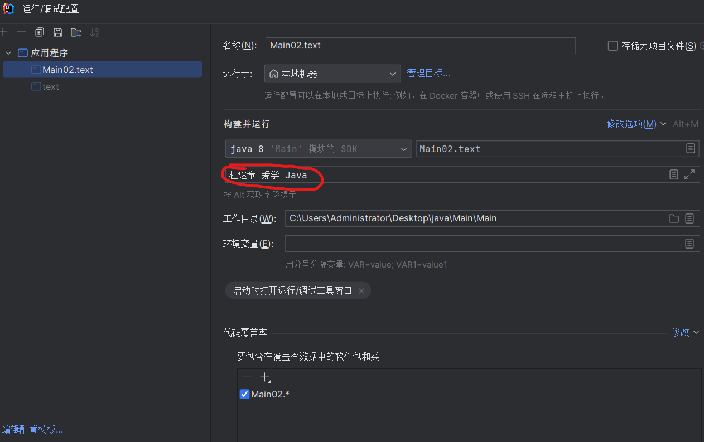

# main方法

## 1、理解main方法

解释main方法的形式：public static void main(String[] args){ }

1. main方法是虚拟机调用
2. Java虚拟机需要调用类的main（）方法，所以该方法的访问权限必须是public
3. Java虚拟机在执行main方法时不必创建对象，所以该方法必须时static
4. 该方法接受String类型的数组参数，该数组中保存执行Java命令时传递给所运行的类的参数
5. Java 执行的程序 参数1 参数2 参数3【举例说明】



+ 特别提示：

1. 在main()方法中，我们可以直接调用main方法所在类的静态方法或静态属性
2. 但是，不能直接访问该类中的非静态成员，必须先创建该类的一个实例对象后，才能通过这个对象去访问类中的非静态成员

```java
public class text {
    private static String name="杜继童";
    private int n1=100;
    public static void hi(){
        System.out.println("Main01中的hi()方法~");
    }
    public void cry(){
        System.out.println("Main01中的cra()方法~");
    }
    public static void main(String[] args) {
        //1、静态方法main 可以直接访问本类的静态成员
        System.out.println("name="+name);
        hi();
        //2、静态方法main 不可以直接访问本类的非静态成员
        //System.out.println("n1="+n1);  错误
        //cry();  错误

        //3、静态方法main 要想调用本类的非静态成员，需要先创建对象在调用即可
        text text = new text();
        System.out.println(text.n1);
        text.cry();
    }
}
```

## 2、main动态传值

在idea中可以用如下方式传参：


