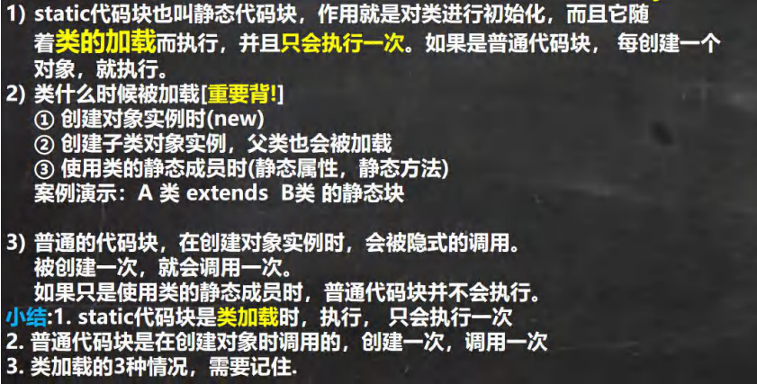
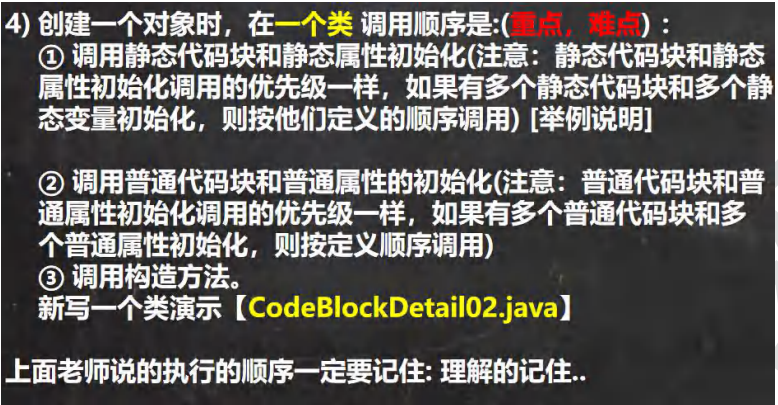
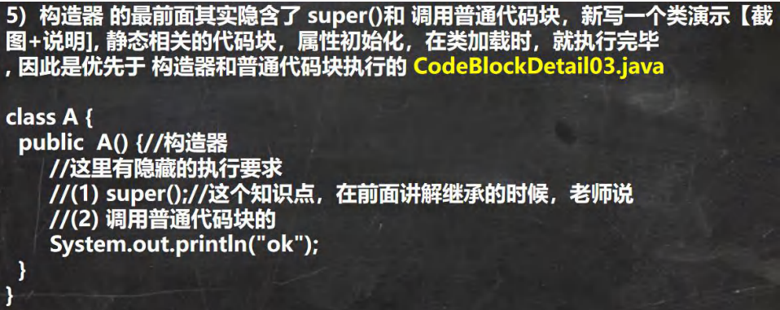
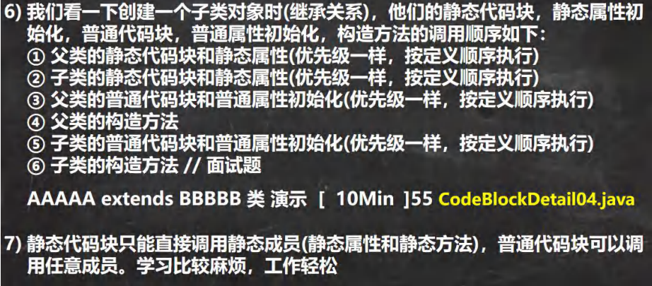

# 代码块

## 1、基本介绍

***代码块又称为初始化块，属于类中的成员[即是类的一部分]，类似于方法，将逻辑语句封装在方法体中，通过{}包围起来。***

***但又和方法不同，没有方法名，没有返回，没有参数，只有方法体，而且不用通过对象或类显式调用，而是加载类时，创建对象时隐式调用。***

## 2、基本语法

[修饰符]{

代码

}；//这个 ；可写可不写

**说明注意**

1. 修饰符可以不写，但是有的话只能是static
2. 代码块分为两类：使用static修饰的代码块；不适用static修饰的
3. 逻辑语句可以为任何逻辑语句（输入，输出，方法调用，循环，判断等）

```java
public class text01 {
    public static void main(String[] args) {
        Movie 潜行 = new Movie("潜行");
    }
}
class Movie{
    private String name;
    private double price;
    private String directer;
/*
    以下构造器中都含有
        System.out.println("电影屏幕打开-------");
        System.out.println("广告中------------");
        System.out.println("电影正式开始-------");
        这样造成了代码的冗余，所以使用代码块可以解决一下问题
        这样不管调用哪个构造器都会先执行代码块里的内容。且代码块的调用优先于构造器。
 */
static {
    System.out.println("电影屏幕打开-------");
    System.out.println("广告中------------");
    System.out.println("电影正式开始-------");
};
    public Movie(String name) {
//        System.out.println("电影屏幕打开-------");
//        System.out.println("广告中------------");
//        System.out.println("电影正式开始-------");
        System.out.println("Movie(String name)被调用----");
        this.name = name;
    }

    public Movie(String name, double price) {
//        System.out.println("电影屏幕打开-------");
//        System.out.println("广告中------------");
//        System.out.println("电影正式开始-------");
        this.name = name;
        this.price = price;
    }

    public Movie(String name, double price, String directer) {
//        System.out.println("电影屏幕打开-------");
//        System.out.println("广告中------------");
//        System.out.println("电影正式开始-------");
        this.name = name;
        this.price = price;
        this.directer = directer;
    }
}
```

## 3、代码块使用注意事项和细节讨论



```java
package CodeBlockdetail;

public class detail01 {
    public static void main(String[] args) {
        /*
        1、static代码块也叫静态代码块，作用就是对类进行初始化，而且它随着类的加载而执行，
           并且只会执行一次。如果是普通代码块，每创建一个对象就执行。
        2、类什么时候被加载【重要！】
           创建对象实例时（new）
           创建子类对象实例，父类也会被加载
           使用类的静态成员时（静态属性，静态方法）
        3、普通的代码块，在创建对象实例时，会被隐式调用。被创建一次就会调用一次
           如果只是使用类的静态成员时，普通代码块并不会执行
        总结如下：
           （1）static代码块是在类加载时，执行，并只会执行一次
           （2）普通代码块是在创建对象时调用的，创建一次，调用一次
           （3）类加载的3种情况非常重要！！！！！！！！！！！
         */
//        new AA();  创建对象实例时（new）
//        new BB();  创建子类对象实例，父类也会被加载
//        System.out.println(Cat.n1);   //使用类的静态成员时（静态属性，静态方法）
        System.out.println(DD.n1);
    }
}
class DD{
    public static int n1=888;
    static {
        System.out.println("DD的静态代码块被调用。。。");
    }
    {
        System.out.println("DD的普通代码块被调用。。。");
    }
}
class AA{
    static {
        System.out.println("AA的静态代码块被执行。。。。");
    }
}
class BB extends AA{
    static {
        System.out.println("BB的静态代码块被执行。。。。");
    }
}
class Animal{
    static {
        System.out.println("Animal的静态代码块被执行。。。。");
    }
}
class Cat extends Animal{
    static int n1=999;
    static {
        System.out.println("Cat的静态代码块被执行。。。。");
    }
}
```



```java
package CodeBlockdetail;

public class detail02 {
    public static void main(String[] args) {
        A a = new A();
    }
}
/*
创建一个对象时，在一个类的调用顺序是：
1、调用静态代码块和静态属性初始化（静态代码块和静态属性初始化的优先级一样，
   如果调用多个静态代码块和静态属性初始化，则按他们定义的顺序调用）
2、调用普通代码块和普通属性的初始化（普通代码块和普通属性的初始化的优先级一样，如果普通代码块和普通属性的初始化
   则按定义顺序调用）
3、调用构造方法
 */
class A{
    private static int n1=getN1();
    private int n2=getN2();

    {
        System.out.println("我是非静态代码块");
    }

    static {
        System.out.println("A的静态代码块被调用");
    }

    static {
        System.out.println("我是第二个静态代码块");
    }
    public static int getN1(){
        System.out.println("静态方法getN1被调用");
        return 100;
    }
    public int getN2(){
        System.out.println("非静态方法getN2被调用");
        return 200;
    }

    public A() {
        System.out.println("我是构造器");
    }
}
```



```java
package CodeBlockdetail;

public class detail03 {
    public static void main(String[] args) {
        new BBB();
    }
}
class AAA{
    {
        System.out.println("AAA的普通代码块");
    }

    public AAA() {
        System.out.println("AAA的无参构造器");
    }
}
class BBB extends AAA{
    {
        System.out.println("BBB的普通代码块");
    }

    public BBB() {
        //super();
        //本类的普通代码块
        System.out.println("BBB的无参构造器");
    }
}
```



```java
package CodeBlockdetail;
/*
我们看一下创建一个子类对象时(继承关系)，他们的静态代码块，静态属性初始化，普通代码块，普通属性初始化，
构造方法的调用顺序如下：
1、父类的静态代码块和静态属性(优先级一样，按定义顺序执行)
2、子类的静态代码块和静态属性(优先级一样，按定义顺序执行)
3、父类的普通代码块和普通属性初始化(优先级一样，按定义顺序执行)
4、父类的构造方法
5、子类的普通代码块和普通属性初始化(优先级一样，按定义顺序执行)
6、子类的构造方法
 */
public class detail04 {
    public static void main(String[] args) {
        new BBBB();//1、AAAA的静态代码块 2、BBBB的静态代码块 3、AAAA的普通代码块 AAAA的无参构造器
                   //4、BBBB的普通代码块 BBBB的无参构造器
    }
}
class AAAA{
    static {
        System.out.println("AAAA的静态代码块");
    }
    {
        System.out.println("AAAA的普通代码块");
    }

    public AAAA() {
        System.out.println("AAAA的无参构造器");
    }
}
class BBBB extends AAAA{
    static {
        System.out.println("BBBB的静态代码块");
    }
    {
        System.out.println("BBBB的普通代码块");
    }

    public BBBB() {
        System.out.println("BBBB的无参构造器");
    }
}
```

## 4、例题

1、下面的代码输出什么？

```java
public class homework01 {
    public static void main(String[] args) {
        System.out.println("total="+Person.total);
    }
}
class Person{
    public static int total;
    static {
        total=100;
        System.out.println("静态代码块");
    }
}
```

2、下面的代码输出什么？

```java
public class homework02 {
    public static void main(String[] args) {
        Test a = new Test();
    }
}
class Sample{
    Sample(String s){
        System.out.println(s);
    }
    Sample(){
        System.out.println("Sample默认构造器被调用");
    }
}
class Test{
    Sample sam1=new Sample("sam1成员初始化");
    static Sample sam=new Sample("静态成员初始化");
    static {
        System.out.println("static块执行");
        if (sam==null) System.out.println("sam is null");
    }

    public Test() {
        System.out.println("Test默认构造器被调用");
    }
}
```

