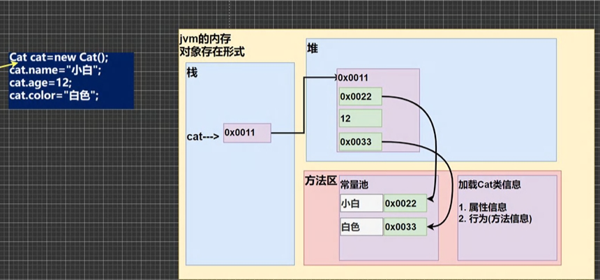

[toc]


# \类与对象\

```java
public class 类与对象 {
    public static void main(String[] args) {
        //cat1是对象名（对象引用）
        //new cat()创建的对象空间（数据）才是真正的对象
        cat cat1=new cat();
        cat1.name="小白";
        cat1.age=10;
        cat1.color="白色";

        cat cat2=new cat();
        cat2.name="小花";
        cat2.age=100;
        cat2.color="花色";
        System.out.println("第一只猫："+cat1.name+" "+cat1.age+" "+cat1.color);
        System.out.println("第二只猫："+cat2.name+" "+cat2.age+" "+cat2.color);

        car car1=new car();
        System.out.println("name="+car1.name+" master="+car1.master+" price="+car1.price);
    }
}
class cat{
    //属性/成员变量-->可以是基本数据类型也可以是引用数据类型（对象，数组）
    String name;
    int age;
    String color;

    //行为
}
class car{
    String name;
    String[] master;
    double price;
}


```

# 对象在计算机的存储方式

