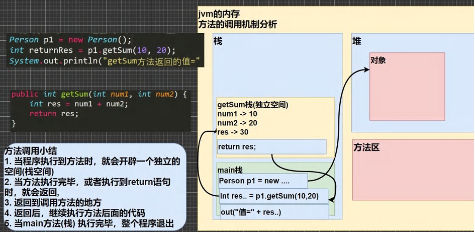

# 成员方法



```java
import com.sun.org.apache.bcel.internal.generic.ARETURN;
/*
方法调用小结
1、当程序执行到方法时，就会开辟一个独立的空间（栈空间）
2、当方法执行完毕或者遇到return语句时，就会返回
3、返回到调用方法的地方
4、返回后继续执行后面的代码
5、当main方法（栈）执行完毕后，整个程序退出
*/
import java.util.Scanner;

public class 成员方法 {
    public static void main(String[] args) {
        Scanner input=new Scanner(System.in);
        person a=new person();
        a.speak();
        //
        int sum=a.cal01();
        System.out.println(sum);
        //
        System.out.println("请输入一个数");
        int n= input.nextInt();
        int sum2=a.cal02(n);
        System.out.println(sum2);
        //
        System.out.println("请输入要计算的两个数");
        int x= input.nextInt();
        int y= input.nextInt();
        int z= a.getsum(x,y);
        System.out.println(z);
    }
}
class person{
    int age;
    String name;
    //方法（成员方法）
    //添加一个speak方法，输出“我是一个好人”
    //public表示方法是公开的
    //void表示无返回值
    public void speak(){
        System.out.println("我是一个好人");
    }
    //计算1-1000相加的方法
    public int cal01(){
        int sum=0;
        for (int i=1;i<=1000;i++){
            sum+=i;
        }
        return sum;
    }
    //从键盘输入一个数n，计算从1加到n的和的方法
    public int cal02(int n){
        int sum=0;
        for (int i=1;i<=n;i++){
            sum+=i;
        }
        return sum;
    }
    //计算两个数的和的方法
    public int getsum(int a,int b){
        int sum=a+b;
        return sum;
    }
}

```

