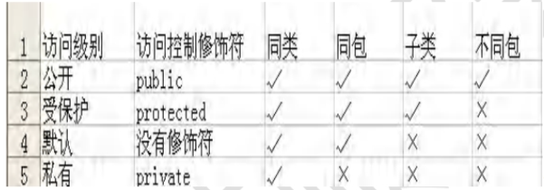

[toc]

# \访问修饰符\

## 1、基本介绍

+ 公开	public	对同类，同包，子类，不同包公开
+ 受保护     protect      对同类，同包，子类公开
+ 默认       没有修饰符  对同类，同包公开
+ 私有        private        对同类公开



## 2、使用注意事项

+ 修饰符可以用来修饰类中的属性，成员方法以及类
+ 只有public和默认的才能修饰类！并且遵循上述访问权限的特点
+ 成员方法的访问规则和属性完全一样

```java
package com.modifier;
public class A {
    public int a=100;
    protected int b=200;
    int c=300;
    private int d=400;
    public void m1(){
        System.out.println("a="+a+" b="+b+" c="+c+" d="+d);
        //在同一个类下可以访问public,protect,默认,private
    }
    protected void m2(){}
    void m3(){}
    private void m4(){}
    public void hi(){
        m1();
        m2();
        m3();
        m4();
    }
}
```

```java
package com.modifier;//同一个包
public class B {
    public void say(){
        A a = new A();
        //在同一个包下可以访问public,protect,默认，不可以访问private
        System.out.println("a="+a.a+" b="+a.b+" c="+a.c);
        a.m1();
        a.m2();
        a.m3();
        //a.m4();是错误的
    }
}
```

```java
package com.modifier01;//和上面的代码不在同一个包
import com.modifier.A;
public class D {
    public void say(){
        A a = new A();
        System.out.println("a="+a.a);
        //在不同包下只能访问public，不能访问protect,默认,private修饰的属性和方法
        a.m1();
    }
}

```

