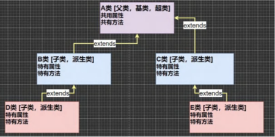
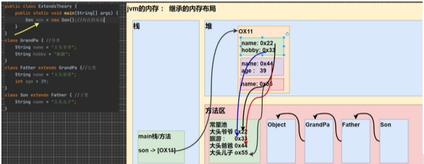

[toc]

# \面向对象编程-继承\

## 1、为什么需要继承？

当要编写两个类，一个是pupil类（小学生），一个是Graduate（大学生）。

当这两个类的属性和方法很多是相同的，这时候就需要继承了。

## 2、继承的基本介绍和示意图

+ 继承可以解决代码复用的问题，当多个类存在相同的属性（变量）和方法时，可以从这些类抽象出父类，在父类中定义这些相同的属性和方法，所有的子类不需要在重新定义这些属性和方法，只需要通过extends来声明继承父类即可。



## 3、继承的基本语法

```java
class 子类 extends 父类{
    
}
/*1、子类就会自动拥有父类定义的属性和方法
  2、父类又叫超类，基类。
  3、子类又叫派生类*/
```

## 4、继承入门案例

### 先创建一个extends01.java用来引用下面的类

```java
package extend_;
public class extends01 {
    public static void main(String[] args) {
        pupol pupol = new pupol();
        pupol.name="小明";
        pupol.age=10;
        pupol.setScore(60);
        pupol.testing();
        pupol.showinfo();
        System.out.println("==============");
        Graduate graduate = new Graduate();
        graduate.name="张三";
        graduate.age=20;
        graduate.setScore(100);
        pupol.testing();
        graduate.showinfo();
    }
}

```

### 创建一个父类student.java

```java
package extend_;

public class student {
    String name;
    int age;
    private double score;

    public void setScore(double score) {
        this.score = score;
    }

    public void showinfo(){
        System.out.println("学生名："+name+" 年龄："+age+" 成绩："+score);
    }
}

```

### 创建一个子类pupil.java

```java
package extend_;

public class pupol extends student{
    public void testing(){
        System.out.println("小学生"+name+"正在考小学数学");
    }
}

```

### 创建一个子类Graduate.java

```java
package extend_;

public class Graduate extends student{
    public void testing(){
        System.out.println("大学生"+name+"正在考大学数学");
    }
}

```

## 5、继承的使用细节

+ 子类继承了所有父类的属性和方法，非私有的属性和方法可以在子类直接访问，但是私有的属性和方法不能在子类直接访问，要通过父类提供的公共的方法去访问

+ 子类必须调用父类的构造器，完成父类的初始化。

+ 当创建子类对象时，不管使用子类哪个构造器，默认情况下总会去调用父类的无参构造器，如果父类没有提供无参构造器，则必须在子类构造器中使用super去指定使用父类的哪个构造器完成对父类的初始化工作，否则，编译就不会通过。

  ```java
      public Sub() {
          super("smith",10);//用super去指定父类的哪个构造器
          System.out.println("Sub()构造器被调用~~~~~~~~~~~~");
      }
  ```

+ 如果希望指定去调用父类的某个构造器，则显示的调用一下：super（参数列表）

+ super在使用时，必须在构造器第一行（super只能在构造器中使用）

+ super（）和this（）都只能放在构造器的第一行，因此这两个方法不能共存在同一个构造器中。

+ Java中所有类都是object类的子类，object是所有类的基类（父类）。

+ 父类构造器的调用不限于直接父类！将一直往上追溯到object类（顶级父类）。

+ 子类最多只能继承一个父类（指直接继承），即Java中是单继承机制。

​       若想A想继承B，C类-->可以让A继承B类再让B类继承C类。

+ 不能滥用继承，子类和父类之间必须满足is-a的逻辑关系。

### 创建一个extendsdetail.java

```java
package extend_02;
public class extendsdetail {
    public static void main(String[] args) {
        Sub sub = new Sub();
        System.out.println("======第二个对象=======================");
        Sub sub1 = new Sub("jack");
//        sub.say();
    }
}
```

### 创建一个Base.java

```java
package extend_02;
public class Base extends Topbase{		//继承Topbase类
    public int n1=100;
    protected int n2=200;
    int n3=300;
    private int n4=400;
    public int getN4() {
        return n4;
    }
//    public Base() {
//        System.out.println("base()构造器被调用~~~~~~~");
//    }
    public Base(String name,int age){
        System.out.println("Base(String name,int age)构造器被调用~~~~~~~~~~~~");
    }
    public void test01(){
        System.out.println("test01");
    }
    protected void test02(){
        System.out.println("test02");
    }
    void test03(){
        System.out.println("test03");
    }
    private void test04(){
        System.out.println("test04");
    }
    public void calltest04(){
        test04();
    }
}
```

### 创建一个Sub.java

```java
package extend_02;
public class Sub extends Base {			//继承Base类
    public Sub() {
        super("smith",10);
        System.out.println("Sub()构造器被调用~~~~~~~~~~~~");
    }
    public Sub(String name){
        super("tom",20);
        System.out.println("Sub(String name)构造器被调用");
    }
    public void say(){
        System.out.println(" "+n1+" "+n2+" "+n3);
        test01();
        test02();
        test03();
        calltest04();
    }
}
```

### 创建一个Topbase.java

```java
package extend_02;
public class Topbase {		//继承于object（顶级父类）
    public Topbase() {
        System.out.println("Topbase()构造器被调用~~~~~~~~~~");
    }
}

```

## 6、继承的本质分析



```java
package extend_03.extendsTheory;

public class Text01 {
    public static void main(String[] args) {
        /*
         按查找关系来返回信息
        1、首先看子类是否有该属性，如果子类有该属性且可以访问就返回该属性的信息
        2、如果子类没有该属性，就看父类有没有这个属性（如果有该属性且可以访问就返回该属性的信息）
        3、如果父类没有这个信息，就按照步骤2继续查找上级父类，知道object。。。
         */
        Sun sun = new Sun();
        System.out.println(sun.name);//返回值是大头儿子
        System.out.println(sun.getGrandpaAge());
        System.out.println(sun.hobby);//返回值是旅游
    }
}

class Grandpa {
    String name = "大头爷爷";
    String hobby = "旅游";
    int age=100;

    public int getGrandpaAge() {
        return age;
    }
}

class Grandfather extends Grandpa {
    String name = "大头爸爸";
    private int age = 30;
    public int getAge(){
        return age;
    }
}

class Sun extends Grandfather {
    String name = "大头儿子";
}
```

