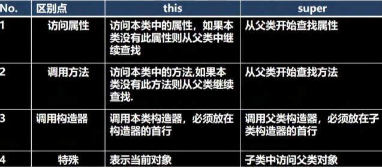

# \super关键字\

## 1、基本介绍

super代表父类的引用，用于访问父类的**属性，方法，构造器**

## 2、基本语法

+ 访问父类的属性，但不能访问父类的private属性
+ 访问父类的方法，但不能访问父类的private方法
+ 访问父类的构造器（注意：只能放在构造器的第一句且只能出现一次）

### 创建A类

```java
public class A {
    public int n1=100;
    protected int n2=200;
    int n3=300;
    private int n4=400;
    public void test1(){
    }
    protected void test2(){
    }
    void test3(){
    }
    private void test4(){
    }
}
```

### 创建B类

```java
public class B extends A{
    public void test(){
        System.out.println(super.n1+" "+super.n2+" "+super.n3); //super.n4不能访问
        super.test1();
        super.test2();
        super.test3();
        //super.test4(); private的方法无法访问
    }
}
```

## 3、super关键字带来的遍历/细节

调用方法时先看本类是否有存在该方法若没有则去查找父类是否有，若还是没有则去查找父类的父类直至object类，注意的是若找到了但是不能直接访问则报错（cannot access），若没有找到则提示方法不存在。**但是用super关键字时是直接查找父类而不去查找本类是否存在！**

+ 调用父类构造器的好处（分工明确，父类属性由父类初始化，子类属性由子类初始化）
+ 当子类中有和父类中的成员（属性和方法）重名时，为了访问父类的成员则必须通过super。如果没有重名，使用super、this、直接访问是一样的效果！
+ super的访问不限于直接父类，如果爷爷类和本类中有同名的成员，也可以使用super去访问爷爷的成员；如果多个基类（上级类）中都有同名的成员，使用super访问遵循就近原则。A->B->C,当然也需要遵守访问权限的相关规则。

## 4、this和super的比较

