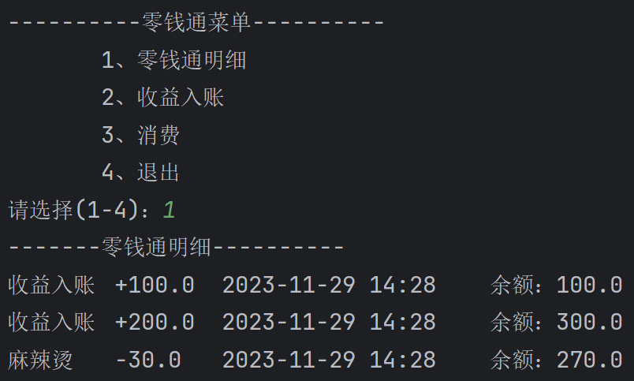

# 项目-零钱通

使用 Java 开发 零钱通项目 , 可以完成收益入账，消费，查看明细，退出系统等功能。

***化繁为简，一步一步去实现，先搭框架后实现具体功能。***



## 步骤一：先完成显示菜单，并且可以选择

***使用do-while，和switch可以实现***

```java
public class test {
    public static void main(String[] args) {
        Scanner input = new Scanner(System.in);
        boolean loop = true;
        int choose;
        do {
            System.out.println("----------零钱通菜单----------");
            System.out.println("       1、零钱通明细");
            System.out.println("       2、收益入账");
            System.out.println("       3、消费");
            System.out.println("       4、退出");
            System.out.print("请选择(1-4)：");
            choose = input.nextInt();
            switch (choose) {
                case 1:
                    System.out.println("-----零钱通明细-----");
                    break;
                case 2:
                    System.out.println("2、收益入账");
                    break;
                case 3:
                    System.out.println("3、消费");
                    break;
                case 4:
                    System.out.println("4、退出");//令loop=false;
                    loop=false;
                    break;
                default:
                    System.out.println("请选择正确的功能（1-4）");
                    break;
            }
        } while (loop);
    }
}
```

## 步骤二：完成零钱通明细

